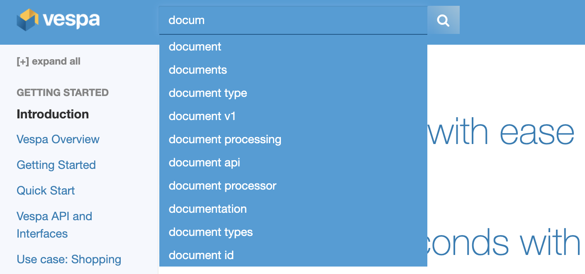

<!-- Copyright Verizon Media. Licensed under the terms of the Apache 2.0 license. See LICENSE in the project root. -->

# Vespa sample application - search suggestions

This sample application is a demo of how one can build search suggestions from a document corpus.
It uses documents from [Vespa Documentation](https://github.com/vespa-engine/documentation)
and extracts terms and phrases.
[Prefix search](https://docs.vespa.ai/en/text-matching-ranking.html#prefix-search) is used,
so suggestions are shown as the user types.

This sample application is also deployed for [vespa-documentation-search](../../vespa-cloud/vespa-documentation-search),
see [schema](../../vespa-cloud/vespa-documentation-search/src/main/application/schemas/term.sd).
Note an enhancement to this sample app:

    field terms type array<string> {
        indexing: summary | attribute
        attribute: fast-search
    }

This to solve the problem of prefix searching every term in the phrase.
Example: A user searching for "rank" should have a suggestion for "learning to rank".
Hence, the script generating suggestions should create something like:

        "update": "id:term:term::learning/to/rank",
        "create": true,
        "fields": {
            "term":  { "assign": "learning to rank" },
            "terms": { "assign": ["learning to rank", "to rank", "rank"] },

With this, prefix queries will hit "inside" phrases, too.

Another consideration is how to remove noise.
A simple approach is to require at least two instances of a word in the corpus.

A simplistic ranking based on term frequencies is used -
a real application could implement a more sophisticated ranking for better suggestions.

## Quick start

**Validate environment, should be minimum 6G:**

<pre>
$ docker info | grep "Total Memory"
</pre>

**Clone sample-apps and go to search-suggestions**

<pre data-test="exec">
$ git clone --depth 1 https://github.com/vespa-engine/sample-apps.git
$ cd sample-apps/incremental-search/search-suggestions
</pre>

**Start the docker container**

<pre data-test="exec">
$ docker pull vespaengine/vespa
$ docker run --detach --name vespa --hostname vespa-example \
  --publish 8080:8080 --publish 19071:19071 \
  vespaengine/vespa
</pre>

**Wait for a 200 OK response** 

<pre data-test="exec" data-test-wait-for="200 OK">
$ curl -s --head http://localhost:19071/ApplicationStatus
</pre>

**Build the application**

<pre data-test="exec">
$ mvn clean package
</pre>

**Deploy the application**

<pre data-test="exec" data-test-assert-contains="prepared and activated.">
$ curl --header Content-Type:application/zip --data-binary @target/application.zip \
  localhost:19071/application/v2/tenant/default/prepareandactivate
</pre>

**Check if application is ready**

<pre data-test="exec" data-test-wait-for="200 OK">
$ curl -s --head http://localhost:8080/ApplicationStatus
</pre>

**Feed the example documents**

<pre data-test="exec">
$ curl -L -o vespa-http-client-jar-with-dependencies.jar \
  https://search.maven.org/classic/remotecontent?filepath=com/yahoo/vespa/vespa-http-client/7.391.28/vespa-http-client-7.391.28-jar-with-dependencies.jar
$ java -jar vespa-http-client-jar-with-dependencies.jar --file example_feed.json --endpoint http://localhost:8080
</pre>

**Generating bootstrapped search terms**

<pre data-test="exec">
$ cd ../../..
$ git clone --depth 1 https://github.com/vespa-engine/documentation.git
$ cd documentation
$ bundle install
$ bundle exec jekyll build -p _plugins-vespafeed
$ cd ../sample-apps/incremental-search/search-suggestions
$ cp ../../../documentation/open_index.json .
$ python3 count_terms.py open_index.json feed_terms.json 2 top100en.txt
</pre>

**Feeding bootstrapped search terms**
<!-- It is hard to assert on no failures in the feed, assert later in term lookup query -->
<pre data-test="exec">
$ java -jar vespa-http-client-jar-with-dependencies.jar --verbose --file feed_terms.json --endpoint http://localhost:8080
</pre>

**Generate set of accepted terms**

<pre data-test="exec">
$ python3 accepted_words.py open_index.json top100en.txt
</pre>

**Generate terms from query log**

Access logs are assumed to be in *logs/*.
<pre>
$ unzstd -c -r logs/ | grep '"uri":"/search/' | grep 'jsoncallback' \
  | jq '{ term: .uri | scan("(?&lt;=input=)[^&]*") | ascii_downcase | sub("(%..|[^a-z0-9]| )+"; " "; "g") | sub("^ | $"; ""; "g"), hits: .search.hits }' \
  | jq '{update: ("id:term:term::" + (.term | sub(" "; "/"; "g"))), create: true, fields: { term: { assign: .term }, query_count: { increment: 1 }, query_hits: { assign: .hits } } }' > feed_queries.json
</pre>

**Feed terms from query log**

<pre>
$ java -jar vespa-http-client-jar-with-dependencies.jar --verbose --file feed_queries.json --endpoint http://localhost:8080
</pre>

**Check the website, write queries and view suggestions**

Open http://localhost:8080/site/ in a browser.
To validate the site is up:
<pre data-test="exec" data-test-assert-contains="search suggestions">
$ curl -s http://localhost:8080/site/
</pre>

**Do a term lookup**

<pre data-test="exec" data-test-assert-contains="id:term:term::doc">
$ curl -s http://localhost:8080/search/?yql=select%20%2A%20from%20sources%20%2A%20where%20term%20contains%20%22doc%22%3B
</pre>

**Shutdown and remove the docker container**

<pre data-test="after">
$ docker rm -f vespa
</pre>

## General

### Indexed prefix search

Indexed prefix search matches documents where the prefix of the term matches the query terms.

To do an indexed prefix search the query needs \[{"prefix":true}],
see [example](https://docs.vespa.ai/en/streaming-search.html#match-mode).
It is important to note that this type of prefix search is not supported for fields set to _index_ in the schema. 
Therefore, all fields for prefix search has to be _attributes_.

Indexed prefix search is faster than using streaming search,
and is also more suitable for situations where multiple concurrent queries might occur and performance is important.

### The sample application

In this sample application indexed prefix search is used to implement search suggestions
based on users' previous queries.
By storing user-input as documents you can get some queries that are not suitable for suggestion.
A way to remedy this is by filtering out user queries that contain terms that are added to a block list
or have a set of accepted terms.
In this sample application a [document processor](https://docs.vespa.ai/en/document-processing.html)
is used to filter out such queries during document feeding.
For demonstration purposes we have implemented both a block list and a set of accepted terms,
but usually only one of these is needed.
