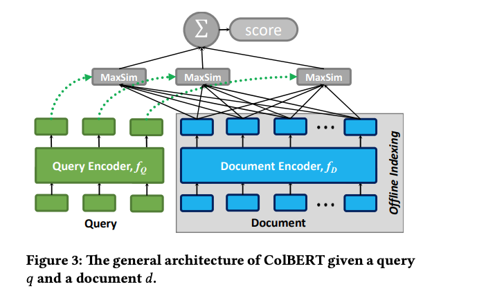

<!-- Copyright Verizon Media. Licensed under the terms of the Apache 2.0 license. See LICENSE in the project root.-->

# MS Marco Passage Ranking using ColBERT - Performance and Scaling

This document describes scaling and serving performance of the ColBERT representation on Vespa. For a general intro to performance
and sizing Vespa see [Vespa performance and sizing documentation](https://docs.vespa.ai/documentation/performance/sizing-search.html)

*The MaxSim operator, Illustration from [ColBERT paper](https://arxiv.org/abs/2004.12832)*

The overall end to end serving performance and ranking accuracy of a trained ColBERT model depends many factors.

- The size and weights of the BERT model which is used to encode the query and the query input sequence length. In our experiments we used [Bert-Medium](https://huggingface.co/google/bert_uncased_L-8_H-512_A-8)
which has 8 layers, and uses hidden dimensionality 512. We fixed the input sequence length to max 32 tokens. Using quantization (int8) weights instead of float32 reduces the
size and run time complexity but also impacts ranking accuracy. 

- The efficiency of the retriever. In our experiments we use a sparse term based retriever accelerated 
by the [Vespa weakAnd query operator](https://docs.vespa.ai/en/using-wand-with-vespa.html). 
The Vespa weakAnd is an implementation of a dynamic pruning algorithm (WAND) which tries
to retrieve the best top-k scoring documents without exhaustive scoring all documents which matches any of the terms in the query. Vespa
does per default not remove common stop words. The Vespa weakAnd implementation will expose all hits which were evaluated to the first-phase ranking expression.

- The ColBERT MaxSim evaluation efficiency which is determined by the number of dimensions used per term and number of terms in the passage. The number of query term embeddings is fixed at 32. 

The retrieval and re-ranking can be be done using multiple threads per query but the query encoding realization is single threaded.  

In this document we document how changing these parameters impacts the offical evaluation metric MRR@10 as measured on 
 the *dev* query split and the end to end performance.  

# Benchmarking setup
We use the 6,980 queries in the dev set to measure end to end latency versus MRR@10.  The latency oriented experiments are run using a single
benchmarking thread and we use the [vespa-fbench](https://docs.vespa.ai/documentation/performance/vespa-benchmarking.html)
http benchmarking utility and latency includes everything including https and data transfer. Since we used MRR at 10 we only fetch the top 10 hits. 
The client benchmarking node is in the same region so network latency is insignificant.  

The single threaded client allows comparing latency of the overall end to end performance and it's variance with respect to the 
different queries in the dev set.  For throughput tests the same query might be performed several times during a run.
We don't perform any caching of neither the query term tensors obtained by the colBERT query encoder model or caching the result of the passage ranking. 
For a production setup caching the query tensor embeddings would likely have a high cache hit ratio. 

For every test all terms and posting 
lists are in-memory so the performance of the IO subsystem is not measured.  

We perform the experiments on a single content node with 2 x Xeon Gold 6240 2.60GHz (hyper-threaded 36 core) but limited to use only 36 threads (docker cpu limits). 
We also use a 16 v-cpu instance to run the stateless container node where the custom logic is implemented. 
The system is deployed as an instance in [cloud.vespa.ai](https://cloud.vespa.ai/).

The evaluation performance might differ on different cpu models depending on what type of instructions they support (e.g avx512 availability).

The content node process (vespa-proton-bin) which holds the entire 8.8M passages and tensor data is just short of using 100GB of memory and feeding and indexing the dataset is 1500 documents per second 
(real time indexing).

# Retriever 

We first look at the retriever and evaluate the Recall@K for the dev query set. The retriever accuracy as measured by Recall@k sets the upper bound on the re-ranker at depth k so we focus on the recall@k metric 
since we aim to re-rank the top k documents using ColBERT. Reported Recall@1K and MRR@10 is inline with [Lucene BM25 based experiments](https://github.com/castorini/anserini/blob/master/docs/experiments-msmarco-passage.md).
 

| WAND k  |  Recall@100 | Recall@500 | Recall@1000 | MRR@10                 |Average number of hits evaluated per query|
|---------|-------------|------------|-------------|------------------------|------------------------------------------|
|1000     |      0.6613 |0.8080      |0.8554       |0.184                   | 871,702                                  |
| 500     |      0.6612 |0.8077      |0.8551       |0.184                   | 532,179                                  |
| 100     |      0.6611 |0.8040      |0.8501       |0.184                   | 179,300                                  |
|  10     |      0.6575 |0.7894      |0.8228       |0.184                   |  50,080                                  |

# Query encoder 

# End to end latency 

## Threads per search = 1

## Threads per search = 2

## Threads per search = 

# End to end throughput

